# Python Review Platform

A real-time code review platform with AI-powered analysis. Combines async job processing, intelligent caching, and a VS Code-style editor for seamless developer experience.

## Architecture

**Backend (Go)**

- RESTful API with JWT authentication
- Async job processing via Redis queues
- Rate limiting per user and endpoint
- PostgreSQL for persistence, Redis for caching and pub/sub

**AI Worker (Python)**

- Distributed task processing
- LLM-based code analysis
- Horizontal scaling ready

**Frontend (Next.js)**

- Monaco editor integration
- Real-time status updates
- Modern authentication flow

## Tech Stack

- **Go 1.22+** - High-performance API server
- **Python 3.13** - AI processing workers
- **PostgreSQL** - Primary datastore
- **Redis** - Queue, cache, pub/sub messaging
- **Next.js 14** - SSR React frontend
- **Monaco Editor** - Production-grade code editor

## Project Structure

```
.
├── backend_go/
│   ├── handlers/       # HTTP layer
│   ├── services/       # Business logic
│   ├── models/         # Domain models
│   ├── middleware/     # Cross-cutting concerns
│   └── database/       # Data access
├── backend_python/
│   ├── worker/         # Queue consumers
│   ├── service/        # LLM integration
│   └── processing/     # Analysis pipeline
└── app/
    ├── login/          # Public routes
    └── (protected)/
        └── editor/     # Protected IDE
```

## Core Features

**Secure Authentication**

- JWT-based sessions with secure refresh flow
- Protected routes with middleware
- Redis-backed session management

**Intelligent Rate Limiting**

- Token bucket algorithm per user
- IP-based protection for auth endpoints
- Configurable per-route limits

**Async Processing**

- Non-blocking review submissions
- Distributed worker architecture
- Real-time completion notifications
- Automatic retry and error handling

**Review Pipeline**

1. Code submission → Immediate job ID return
2. Redis queue → Decoupled processing
3. AI worker → LLM analysis
4. Pub/sub notification → DB update
5. Frontend polling → Result delivery

## System Interaction Flow

```mermaid
sequenceDiagram
    actor User
    participant Frontend as Next.js Frontend
    participant GoAPI as Go Backend (API)
    participant GoAuth as Go Auth Service
    participant Redis as Redis Cache
    participant DB as Database
    participant RabbitMQ as RabbitMQ
    participant PyService as Python AI Service

    Note over User,PyService: Registration Flow
    User->>Frontend: Sign up (email, password)
    Frontend->>GoAPI: POST /auth/register
    GoAPI->>GoAuth: Validate & hash password
    GoAuth->>DB: Store user credentials
    DB-->>GoAuth: User created
    GoAuth->>Redis: Cache user session
    GoAuth-->>GoAPI: User ID, tokens
    GoAPI-->>Frontend: JWT access + refresh tokens
    Frontend->>Frontend: Store tokens (httpOnly cookies)
    Frontend-->>User: Registration successful

    Note over User,PyService: Login Flow
    User->>Frontend: Login (email, password)
    Frontend->>GoAPI: POST /auth/login
    GoAPI->>GoAuth: Validate credentials
    GoAuth->>DB: Query user by email
    DB-->>GoAuth: User record
    GoAuth->>GoAuth: Verify password hash
    GoAuth->>Redis: Store session (user_id, claims)
    GoAuth->>Redis: Store refresh token
    Redis-->>GoAuth: Cached
    GoAuth-->>GoAPI: JWT access + refresh tokens
    GoAPI-->>Frontend: Set tokens in response
    Frontend->>Frontend: Store tokens
    Frontend-->>User: Login successful

    Note over User,PyService: Authenticated Request (Async via RabbitMQ)
    User->>Frontend: Request code review
    Frontend->>GoAPI: POST /reviews (with JWT)
    GoAPI->>GoAuth: Validate JWT token
    GoAuth->>Redis: Check token blacklist
    Redis-->>GoAuth: Token valid (not blacklisted)
    GoAuth->>Redis: Get cached user session

    alt Cache hit
        Redis-->>GoAuth: User session data
        GoAuth-->>GoAPI: User ID, claims
    else Cache miss
        Redis-->>GoAuth: Cache miss
        GoAuth->>DB: Query user data
        DB-->>GoAuth: User record
        GoAuth->>Redis: Cache user session (TTL)
        GoAuth-->>GoAPI: User ID, claims
    end

    GoAPI->>DB: Create review job record (status: pending)
    DB-->>GoAPI: Job ID
    GoAPI->>RabbitMQ: Publish review job<br/>(job_id, code, user_id, metadata)
    RabbitMQ-->>GoAPI: Message queued
    GoAPI-->>Frontend: Job accepted (job_id, status: pending)
    Frontend-->>User: Review queued, processing...

    Note over RabbitMQ,PyService: Async Processing
    PyService->>RabbitMQ: Consume review job
    RabbitMQ-->>PyService: Job message
    PyService->>PyService: Perform AI code review
    PyService->>RabbitMQ: Publish review result<br/>(job_id, results)

    GoAPI->>RabbitMQ: Consume review result
    RabbitMQ-->>GoAPI: Result message
    GoAPI->>DB: Update review job (status: completed)
    GoAPI->>Redis: Cache review result (short TTL)

    Note over Frontend,GoAPI: Frontend polls or WebSocket updates
    Frontend->>GoAPI: GET /reviews/{job_id}
    GoAPI->>Redis: Check cached result
    alt Cache hit
        Redis-->>GoAPI: Review result
        GoAPI-->>Frontend: Review response
    else Cache miss
        GoAPI->>DB: Query review result
        DB-->>GoAPI: Review data
        GoAPI-->>Frontend: Review response
    end
    Frontend-->>User: Display review

    Note over User,PyService: Token Refresh Flow
    User->>Frontend: Action (token expired)
    Frontend->>GoAPI: Request with expired token
    GoAPI->>GoAuth: Validate JWT
    GoAuth->>Redis: Check token
    Redis-->>GoAuth: Token expired
    GoAuth-->>GoAPI: 401 Unauthorized
    GoAPI-->>Frontend: Token expired
    Frontend->>GoAPI: POST /auth/refresh (refresh token)
    GoAPI->>GoAuth: Validate refresh token
    GoAuth->>Redis: Check refresh token
    alt Token in Redis
        Redis-->>GoAuth: Valid refresh token
        GoAuth->>GoAuth: Generate new access token
        GoAuth->>Redis: Update session
        GoAuth-->>GoAPI: New access token
        GoAPI-->>Frontend: New access token
        Frontend->>Frontend: Retry request
    else Token not found/invalid
        Redis-->>GoAuth: Invalid
        GoAuth-->>GoAPI: Refresh token invalid
        GoAPI-->>Frontend: 401 Unauthorized
        Frontend-->>User: Redirect to login
    end

    Note over User,PyService: Logout Flow
    User->>Frontend: Logout
    Frontend->>GoAPI: POST /auth/logout (JWT)
    GoAPI->>GoAuth: Process logout
    GoAuth->>Redis: Add token to blacklist (TTL = token expiry)
    GoAuth->>Redis: Delete refresh token
    GoAuth->>Redis: Delete user session
    Redis-->>GoAuth: Deleted
    GoAuth->>DB: Log logout event
    GoAuth-->>GoAPI: Logout confirmed
    GoAPI-->>Frontend: Success
    Frontend->>Frontend: Clear all tokens
    Frontend-->>User: Logged out

    Note over GoAPI,PyService: RabbitMQ Exchanges & Queues
    Note over GoAPI: Publishes to: code.review.request
    Note over PyService: Consumes from: code.review.request<br/>Publishes to: code.review.response
    Note over GoAPI: Consumes from: code.review.response
```



## Running Locally

**Prerequisites**

- Go 1.22+
- Python 3.13+
- PostgreSQL
- Redis
- Node.js 18+

**Backend (Go)**

```bash
cd backend_go
go mod download

# Configure environment
cat > .env << EOF
DATABASE_URL=postgres://postgres@localhost:5432/code_reviewer?sslmode=disable
REDIS_ADDR=localhost:6379
JWT_SECRET=$(openssl rand -base64 32)
EOF

go run cmd/main.go cmd/setup.go
```

**AI Worker (Python)**

```bash
cd backend_python
python -m venv venv
source venv/bin/activate
pip install -r requirements.txt

python -m backend_python.worker.ai_worker
```

**Frontend**

```bash
cd app
npm install
echo "NEXT_PUBLIC_API_URL=http://localhost:8080" > .env.local
npm run dev
```

**Infrastructure (Docker)**

```bash
# PostgreSQL
docker run --name postgres-dev \
  -e POSTGRES_PASSWORD=postgres \
  -e POSTGRES_DB=code_reviewer \
  -p 5432:5432 -d postgres:15

# Redis
docker run --name redis-dev -p 6379:6379 -d redis:7
```

## API Reference

**Authentication**

- `POST /api/auth/register` - User registration
- `POST /api/auth/login` - Authentication (5 req/min)
- `POST /api/auth/logout` - Session invalidation
- `GET /api/users/me` - Current user profile

**Reviews**

- `POST /api/reviews` - Submit code (10 req/hr)
- `GET /api/reviews/{id}` - Fetch review status

**System**

- `GET /healthz` - Service health

## Architecture Decisions

**Redis as Message Queue**
Provides caching, queuing, and pub/sub in one system. Reliable FIFO with `BRPOP`, sufficient for current scale with path to RabbitMQ if needed.

**Separate Python Worker**
Leverages Python's mature LLM ecosystem while keeping Go API lightweight. Workers can scale independently based on processing demand.

**Polling over WebSockets**
Review latency (5-10s) makes 2s polling acceptable. Simpler infrastructure, easier debugging. WebSockets planned for collaborative features.

**Token Bucket Rate Limiting**
Accommodates legitimate burst patterns (batch submissions) while preventing abuse. More user-friendly than strict fixed windows.

**Service Layer Pattern**
Clean separation of HTTP concerns from business logic. Enables testing, reuse, and potential microservice extraction.

## Roadmap

**Near Term**

- WebSocket support for instant notifications
- Multi-file project management
- Enhanced editor features (tabs, file tree)
- Review history and analytics dashboard

**Future Vision**

- Multi-language support (Go, JavaScript, Java)
- Team collaboration and shared workspaces
- CI/CD integration
- Custom rule engines
- Enterprise SSO

## Production Considerations

Current architecture designed for:

- 100-10K concurrent users
- Horizontal scaling of Python workers
- Database connection pooling
- Redis cluster support
- Containerized deployment ready

Migration to microservices considered for 100K+ users.

---

**Status:** Active development | MVP complete | Production-ready with monitoring additions
